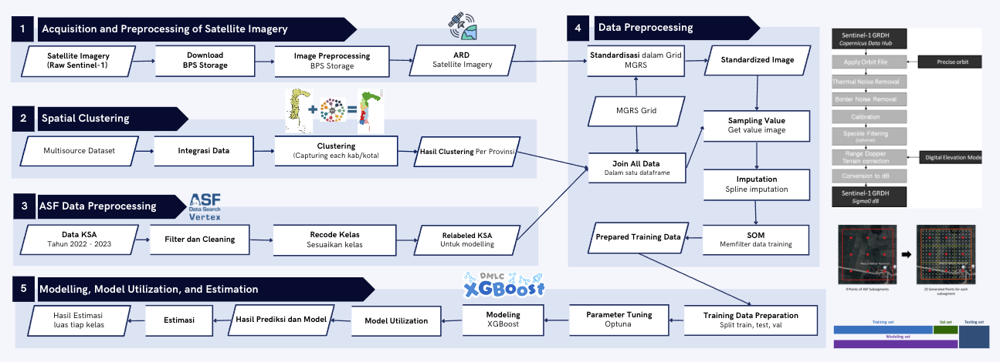

# Mixed Method Research Project: Earth Observation Data for Paddy Crop Phenology Identification 

Rice data is a critical national resource in Indonesia for formulating food security policies. The traditional methods for estimating rice production involve the Area Sampling Frame (ASF) Survey for identifying crop phenology and the Crop Cutting Survey for yield measurement. However, these methods face challenges, including high operational costs and non-responses in remote areas. To address these limitations, Statistics Indonesia (BPS) has developed a machine learning-based model integrating Earth Observation (EO) data and field surveys. The methodology utilizes multi-year ASF data combined with Sentinel-1 satellite imagery to train models capable of predicting rice phenology and estimating harvest areas. The approach includes preprocessing satellite data, spatial clustering for regional specificity, and employing the XGBoost algorithm for modeling. Initial implementation in 10 pilot provinces demonstrates high predictive accuracy, particularly in regions with uniform agricultural patterns, although challenges persist in heterogeneous or fragmented landscapes. This innovation significantly reduces the need for field surveys, offering cost-effective and timely data collection. Moreover, it enhances Indonesia’s capacity for agricultural monitoring and contributes to the modernization of official agricultural statistics. The project highlights the potential of integrating EO technologies with statistical frameworks to support sustainable development goals. 

## Methodology

